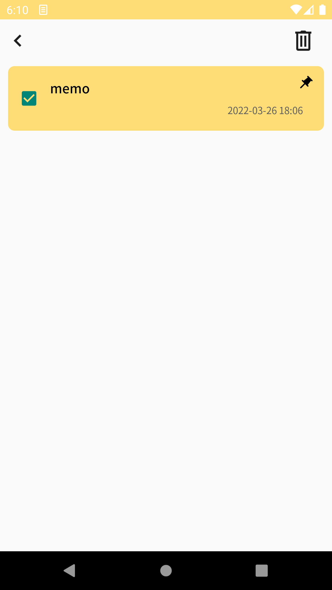
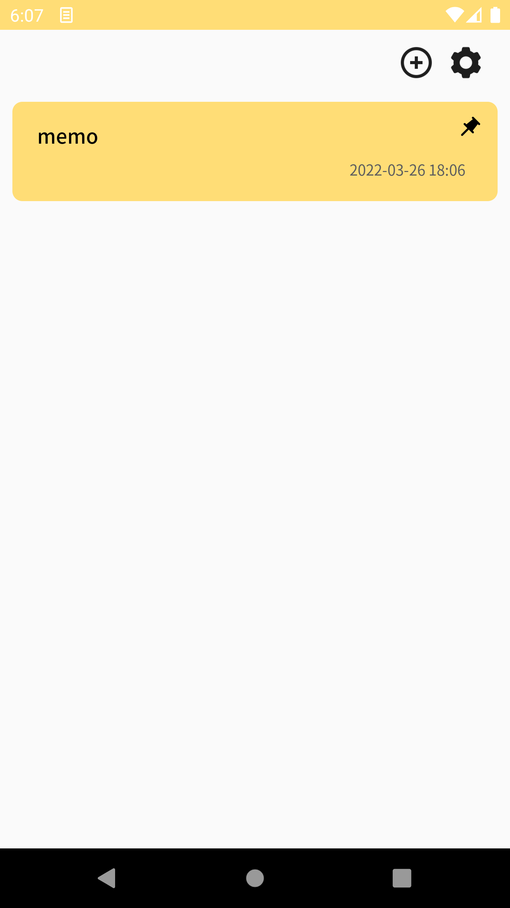
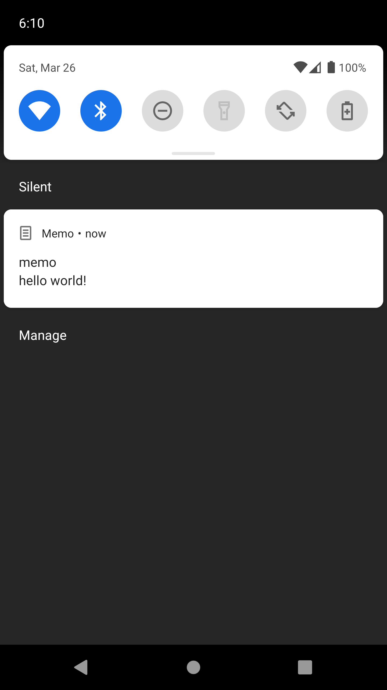
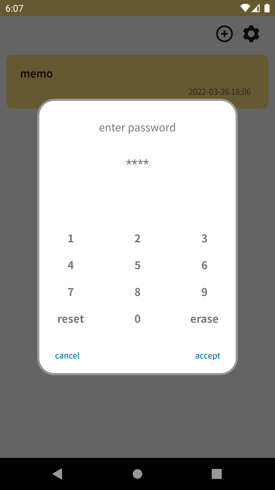
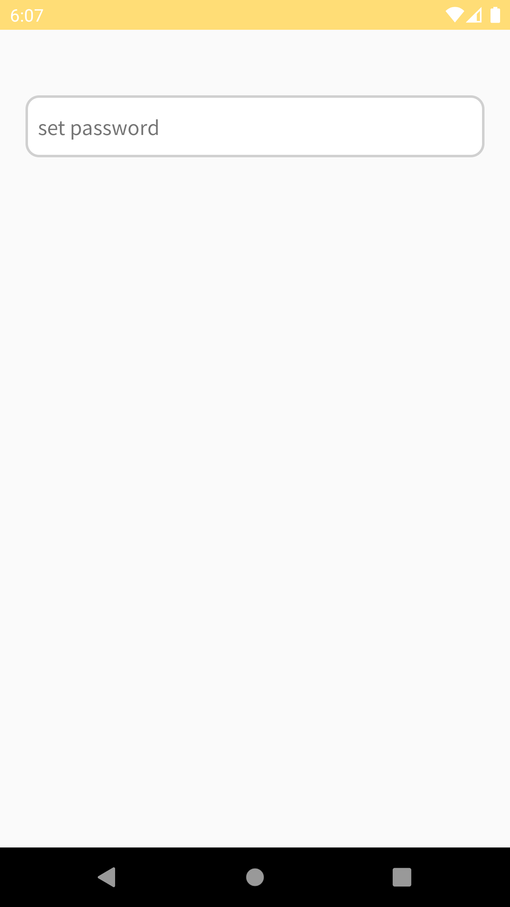
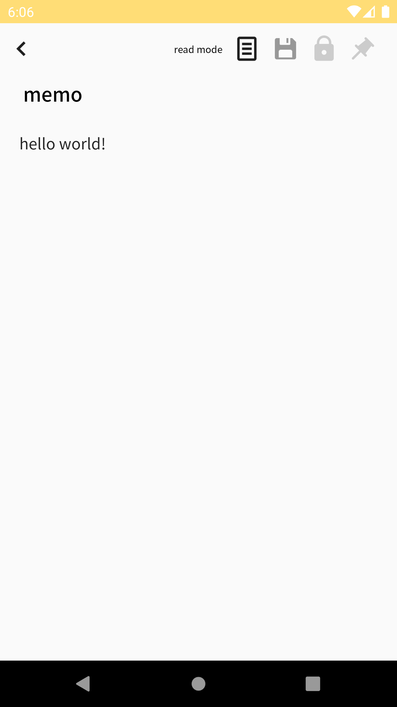

# mvvm

this project was developed for practice mvvm patterns.

## skills
- android, kotlin
- mvvm
- databinding
- roomDb

## function
### add / modify / delete notes.  
- add note : press add button.   
- delete note : long press at the list.  
- modify note : press the note want to modify.  
  

### pin notes to the status bar.    
- note can be pinned in the note page. it will not erased until user unset pin.  
- there is no limited for number of pin
- pin image will be visible when it pinned, and invisible for un-pinned
 

### set password.  
- can set password at setting page or if you set password firstTime, click password button at memo page.  
- Passwords can be set individually per note but share the same number.
 

### change mode.  
- readMode : modify text is impossible until change mode to writeMode even if click the window
- writeMode : modify text is possible.  
 
